# Automatic Colorization of Eiffel Tower Images

## Overview

The focus of this work is the development of a digit recognition system for spoken language. Specifically, the system follows a series of processes to achieve the final recognition of digits from 0 to 9. Initially, the audio signal is sampled, reducing the sampling rate and thus the size of the audio material to be processed. Next, the sound is processed using filters, which will be discussed later, to enhance the audio quality. Following this, each digit in the audio signal is isolated, distinguishing between background noise and speech, implemented in two different ways. Finally, the most critical stage, digit recognition, was also implemented using two approaches, both of which will be reviewed in the pursuit of optimal results. The following sections outline the thought process, detailing both successful and unsuccessful attempts, along with a comprehensive analysis of the system.

## Project Steps

### 1. Audio Data Collection

The audio clip data used for this project can be found at the following page: [AudioMNIST GitHub](https://github.com/soerenab/AudioMNIST). The dataset consists of 30,000 audio clips from 60 different speakers, with details about these speakers, such as age and country of origin, available in the file `AudioMNIST/data/audioMNIST_meta.txt`. This metadata file was removed, so the data folder contains only the audio clips. Other files in the repository that are not part of the dataset were ignored.

### 2. Speech and Background/Silence Classification

For this part audio clips are preprocessed for recognition by performing the following steps:

1. **Load Audio**: The audio clip is loaded into a temporary list.
2. **Resample**: The audio is resampled from 44,100 Hz to 10,000 Hz for faster processing with minimal quality loss.
3. **Filter Signal**: Apply low-pass and high-pass filters to capture relevant frequencies. [This tool](https://fiiir.com) was used to plot the filters.

Low-Pass Filter          |  High-Pass filter
:-------------------------:|:-------------------------:
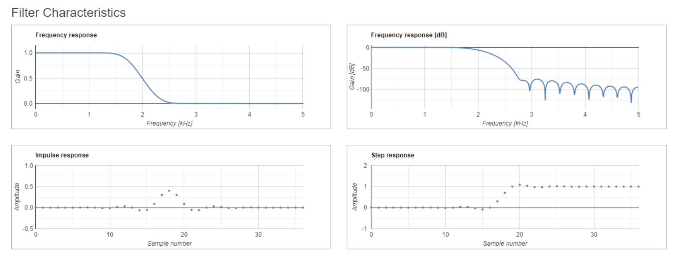  |  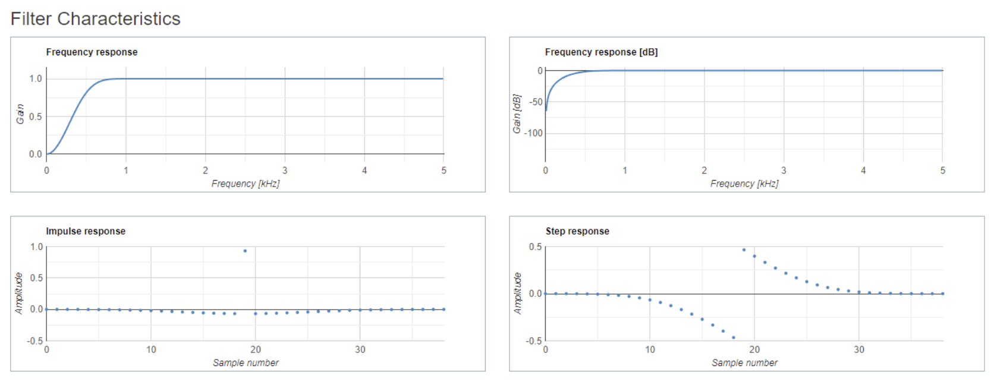

4. **Remove DC Offset**: DC offset is removed to enhance audio quality.
5. **Classify Audio**:
   - **Librosa-based Method**: The signal is divided into 30ms windows to detect speech onset and offsets. Converts window numbers to time and sample indices to find speech segments, ensuring start points are at least one second apart.
   - **Energy and Zero-Crossing Rate Method**: The audio is divided into 30ms windows with a 10ms sliding step, and each window is processed using a Hamming window. 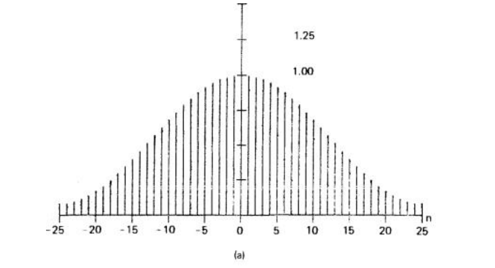
   Energy and zero-crossing rates are calculated and compared against empirical thresholds. 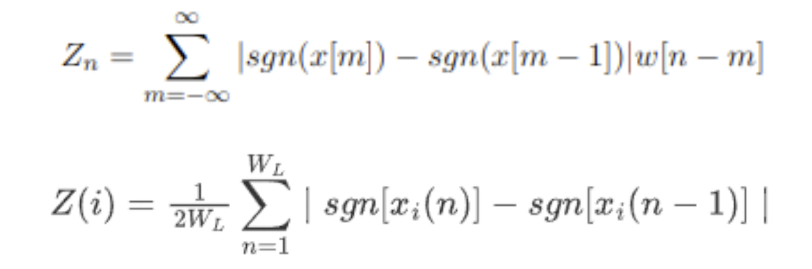In general, **background noise is characterized by low energy but a high zero-crossing rate**, while **speech sound is characterized by high energy but a low zero-crossing rate**.
   This observation is illustrated below: the left diagram represents background noise, showing a higher zero-crossing rate and lower energy compared to the right diagram, which represents a speech sound signal. The right diagram shows higher energy and a lower zero-crossing rate.

    Audio with no speech     |  Audio with speech
    :-------------------------:|:-------------------------:
    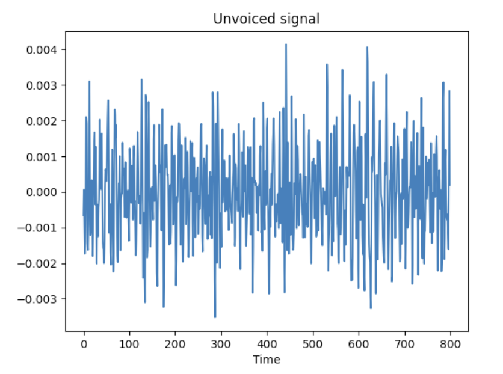  |  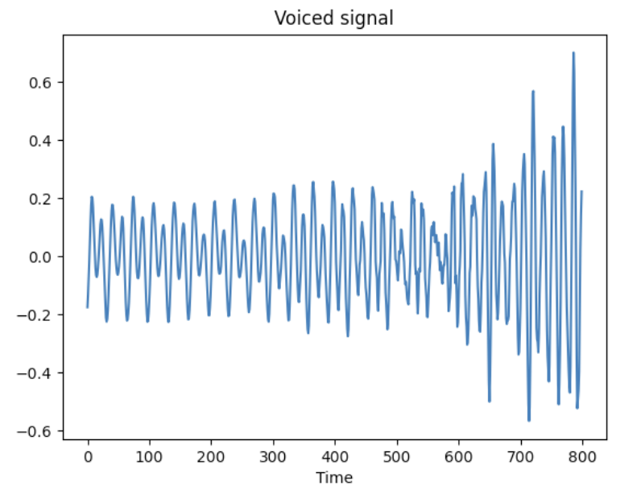

    Windows are classified based on these thresholds, with median filtering applied to correct errors. Speech start and end points are identified, along with the count of digits detected.

Returns pairs of sample numbers indicating the start and end of speech, while removing background noise. Examples are shown below:

Librosa approach     |  Threshold approach
:-------------------------:|:-------------------------:
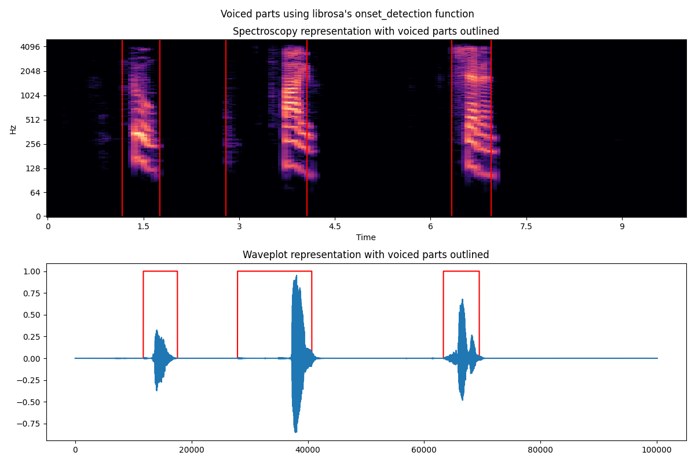  |  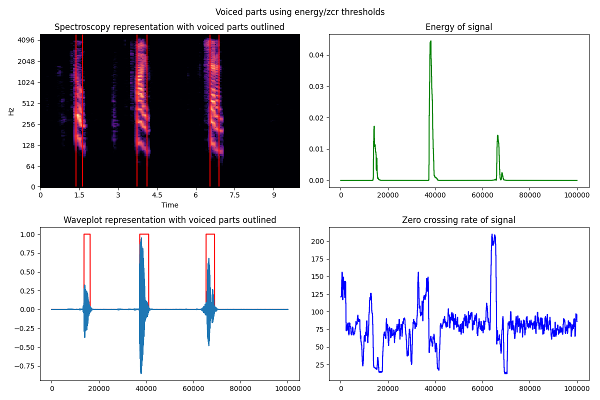

### 3. Feature Extraction

After classifying the background and speech for each clip (i.e., each digit), the next step is to extract features for training the model. Two methods are used for feature extraction:

- **DFT Coefficients**: Extract the Discrete Fourier Transform (DFT) coefficients from each window to construct the mel-spectrogram. The average of all DFT coefficients forms the feature matrix for each digit.
  
- **MFCC Features (optional)**: Extract Mel-Frequency Cepstral Coefficients (MFCC) for comparison, widely used in speech recognition.

Below you can observe the mel-spectrograms and mfcc features visualized for each digit from a random participant.

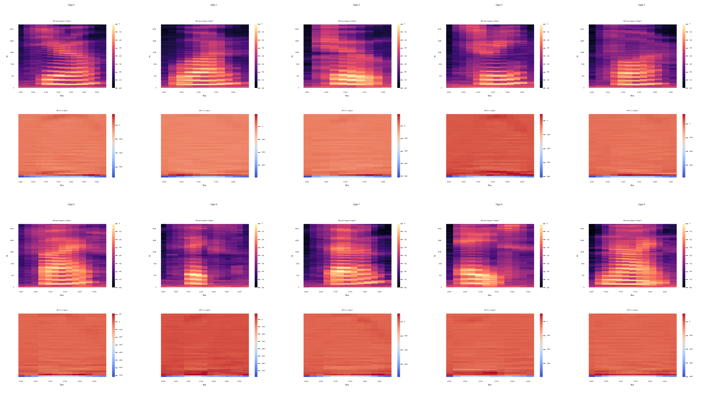

### 4. Training and Testing Steps for Digit Classification

1. **Loading Data**: Load feature matrices (DFT coefficients or MFCC features) and labels.

2. **Splitting Data**: Split data into 70% training and 30% testing sets.

3. **Neural Network Architecture**:
   - **Input Layer**: Size = 128 (feature vector length).
   - **Hidden Layers**:
     - 1st layer: 128 neurons.
     - 2nd layer: 64 neurons.
   - **Output Layer**: 10 neurons (one for each digit class).

4. **Training**:
   - 150 epochs, batch size = 64, learning rate = 1e-3.
   - Early stopping to avoid overfitting.

5. **Evaluation**: Assess model accuracy using the test set.

Below you can inspect the results throught training/validation loss curves, confusion matrices and basic classification metrics (precision, recall and f1-score).

#### Mel Spectrogram features

|**Preprocessing method** | **Results**  |
|-----------------|---|
| **None**  | 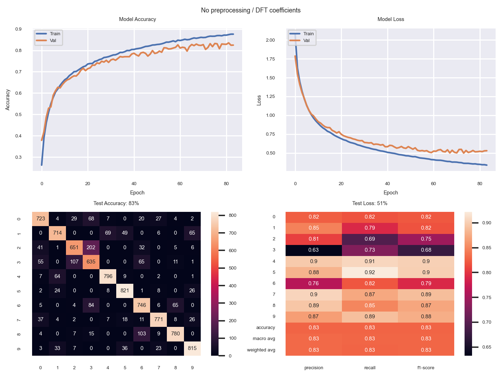 |
| **Librosa**  | 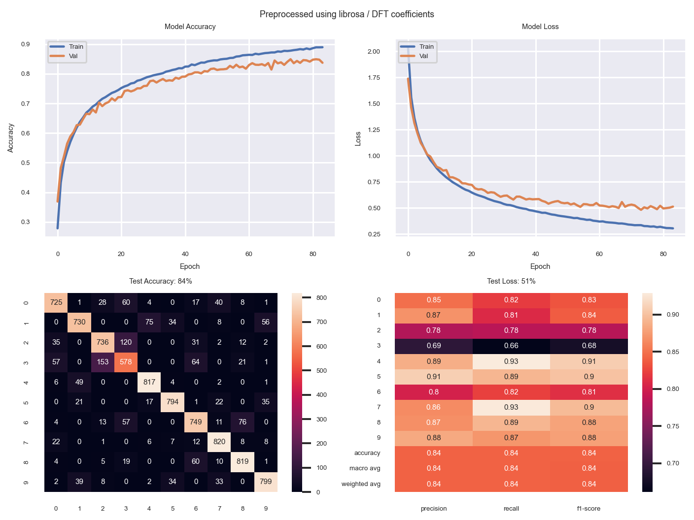 |
| **ZCR/Energy thresholds**  |   |

#### MFCC features

|**Preprocessing method** | **Results**  |
|-----------------|---|
| **None**  | 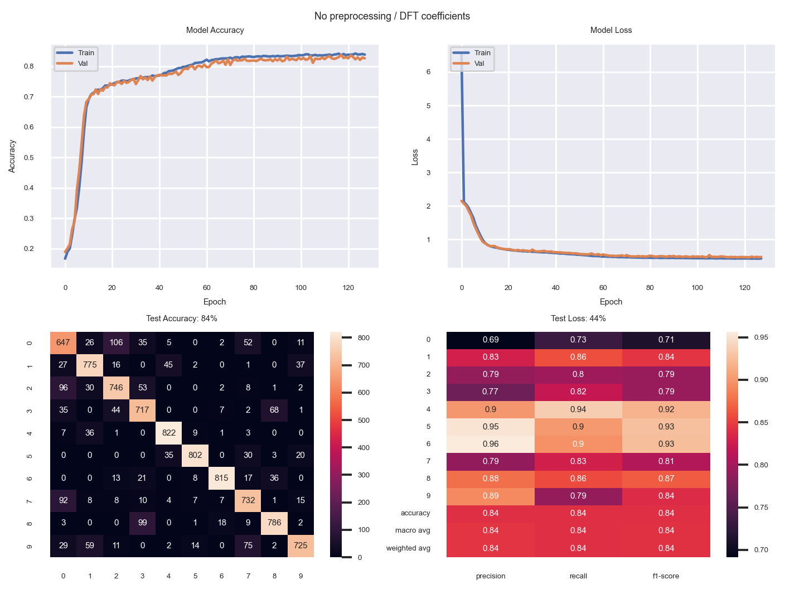 |
| **Librosa**  | 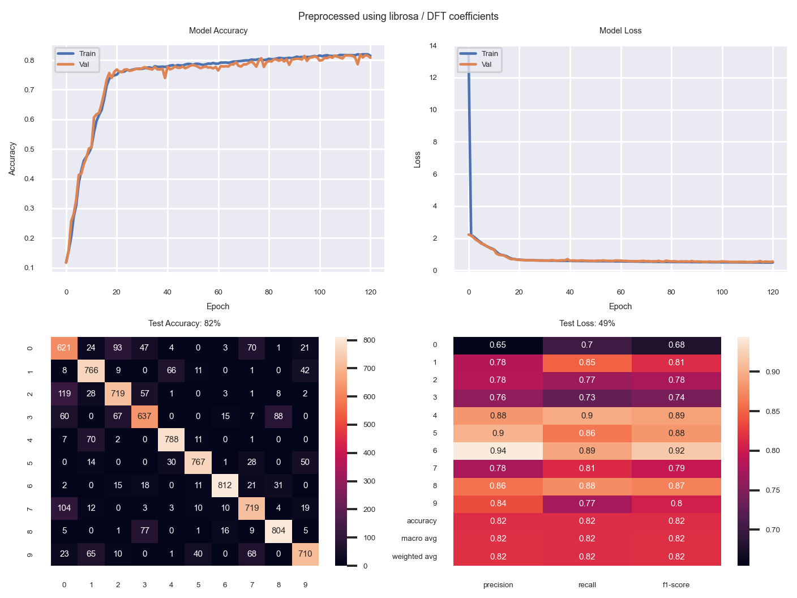 |
| **ZCR/Energy thresholds**  | 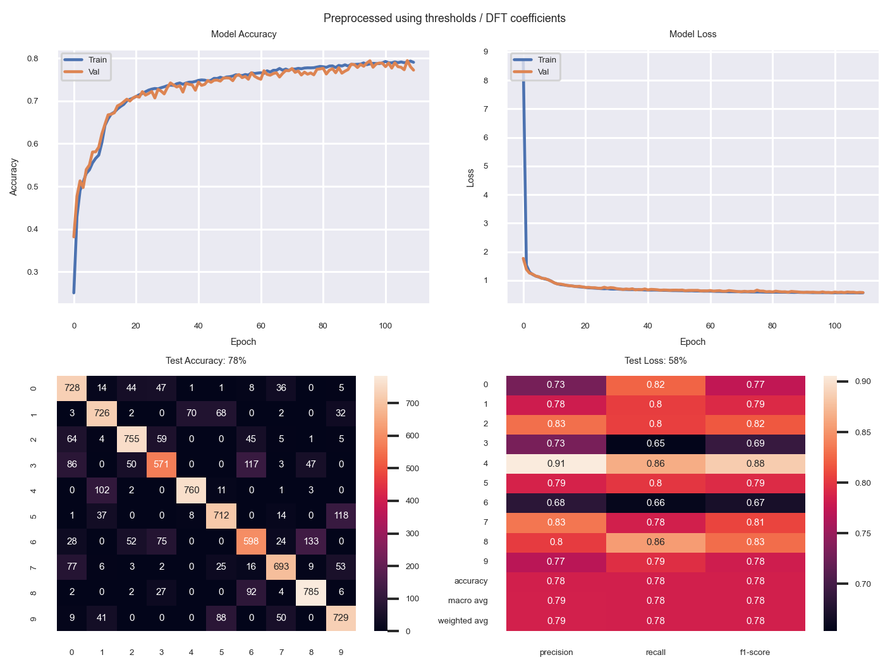  |

### 5. Model Testing with Real Data

You can test the models using mel spectrogram features by either providing a custom audio file (there is a demo one called demo.wav) or recording a 10-second clip in real-time. Follow these steps to get predictions:

1. **Prepare Your Audio File**: Ensure you have an audio file ready or record a 10-second clip directly.

2. **Run the Script**: Execute the script `test_real_data.py`.

3. **Interact with the Command Prompt**: Follow the on-screen instructions to:
   - Upload your custom audio file or
   - Record a new 10-second audio clip.

The script will process the audio using all preprocessing methods and provide predictions based on the mel spectrogram features.

## 6. Potential Improvements for the System

Several actions could enhance the performance of the digit recognition system:

1. **Larger Dataset**
Expanding the dataset beyond the current 30,000 audio clips could significantly improve model performance. A more diverse dataset, including a variety of accents and speakers (beyond a majority of German-speaking men), would provide a more comprehensive representation of speech.

2. **Data Augmentation**
    To address the limited amount of data, consider applying data augmentation techniques. Potential strategies include:
    - **Adding Gaussian noise** to the audio clips.
    - **Shifting the audio signal** or altering the pitch of the speaker's voice.
    - **Extending the duration** of the audio clips.

    These modifications would introduce minor variations, potentially resulting in distinct samples.

    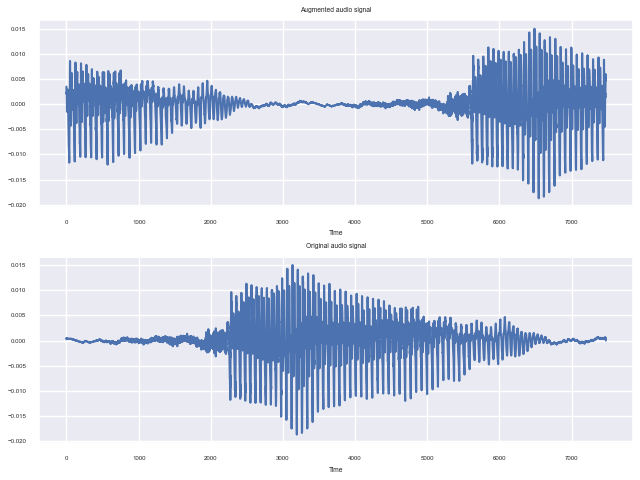

3. **Complex Neural Network Architecture**
Implementing a more complex neural network architecture with temporal information could potentially improve the accuracy of digit predictions.

4. **Threshold Optimization**
The thresholds used for classification could be optimized using heuristic search algorithms, as discussed in the book: *Rabiner, Lawrence R., and Ronald W. Schafer. Digital Processing of Speech Signals*.

## Getting Started

### Prerequisites

- Python 3.x
- Virtualenv for creating isolated Python environments

### Installation and Running

You can run the entire project using the included `Makefile`. The `Makefile` will set up a virtual environment, install dependencies, and run all necessary steps. To execute the project, simply run the following command:

```bash
make
```

**This command will**:

1. Clone the repository with the data directory using sparse-checkout.
2. Create a virtual environment.
3. Install all required dependencies listed in requirements.txt.
4. Execute the following Python scripts in order:
    - prepare_data.py: Prepare and preprocess data.
    - train_test.py: Train and evaluate the model.
    - test_real_data.py: Test the model with real data and wait for user input.

**Running Independent Scripts**:

To run specific parts of the project independently, use the following commands:

```bash
make prepare-data  # Prepare and preprocess data
make train-test    # Train and evaluate the model
make test-real     # Test the model with real data
```

**Clean Up**:
To remove the virtual environment and cloned repository, run:

```bash
make clean
```
